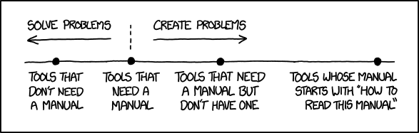

<div class="container">
<div class="col">
<center>

</center>
</div>
<div class="col">
<div style="display: flex; align-items: center; justify-content: center; height: 100%;">
<div style="text-align: center;">

# ExpectedIT GmbH
## Skill Exchange - Git 
### October 2025 - Bastien Heneffe

</div>
</div>
</div>
</div>

---
# Scope
- 🛠️ [**Tools**](#tools) recommendations, to go beyond the git CLI
- ⚡  [**Tips**](#tips) 4 warm-up slides
- 🎯 [**Problems/Solutions**](#probs) 12 annoying scenarios
- 📋 [**Methodology**](#methodo) subjects to discuss

#
*Don't hesitate to interrupt to ask questions.* ✋/💬

---
# Audience: Rate yourself


<center>

</center>

---
<center>

# 🛠️ Tools<a id="tools"></a>


</center>


---
# Recommended tools - TUI
## Command Line
- **Built-in**: `git log --oneline --graph`
- Ensure you have [**git completion**](https://raw.githubusercontent.com/git/git/master/contrib/completion/git-completion.bash) enabled
- git status in **prompt**: custom `PS1` or plugins [bash-it](https://github.com/Bash-it/bash-it), [oh-my-zsh](https://ohmyz.sh/), [oh-my-bash](https://github.com/ohmybash/oh-my-bash), ...
- **tig** - Terminal UI for browsing git history with vim-like navigation
- **lazygit** - Terminal UI with mouse support for git operations

---
# Recommended tools - GUI

## VS Code Integration
- Built-in **Source control panel**
  Graph, wrap for most common git commands, Copilot interactions, ...
- **GitLens / [GitLess](https://marketplace.visualstudio.com/items?itemName=maattdd.gitless)** extension
  Interactive rebase helper, in-code git blame info, ...
  *Avoid the bloatware:  Gitless forked before premium features*
- **[GitHub Pull Requests](https://marketplace.visualstudio.com/items?itemName=GitHub.vscode-pull-request-github)** extension
  Integration for merge request, review, etc.
- **[GitHub Action](https://marketplace.visualstudio.com/items?itemName=GitHub.vscode-github-actions)** extension
  Integration of CI / workflow
- **[GitHub Copilot](https://marketplace.visualstudio.com/items?itemName=GitHub.copilot)** extension
  smart actions: commit message, add commit # to context, etc.

---

<center>

# 🛠️ Tips<a id="tips"></a>

</center>

---
# Tip 1: "Oops, wrong commit!"

## The solutions
- ✏️ **Modify**:
  - `git add ...` - stage what is missing
  - `git commit --amend` - Commit staged changes and edit commit message
  - `git commit --amend --no-edit` - Commit staged changes (keep same message)
- ↩️ **Undo**:
  - `git reset HEAD~1` - Undo last commit, keep changes
  - `git reset --hard HEAD~1` - Undo commit and changes
  - `git revert -m 1 <merge-commit-hash>` - Undo a merge with ancestors

*(We're warming-up, push force stuff will come later)*

---
# Tip 2: "I always forget the args of git checkout"

Use the user-friendly `git switch` and `git restore`
- 🌿 **Make a branch**:
  - Use `git switch -c <new-branch> <start-point>`
  - instead of  `git checkout <start-point> ; git checkout -b <new-branch>`
- ↩️ **Restore a file** deleted by mistake 
  - Use `git restore --source=<commit> <files>`
  - instead of  `git checkout <commit-hash> -- <files>`
- 🔀 **Switch to the previous branch**
  - `git switch -`

---
# Tip 3: Temporary work management

## Quick stashing for context switches  
- `git stash` - Save work temporarily
- `git stash list` - See all stashes
- `git stash pop` - Restore saved work
- `git stash -m "foo bar"` - Save work temporarily, with a description
- `git stash pop {ID}` - Restore saved work in stash entry {ID}

## Be careful
- More complex stash usages and commands (clear/store/save/...) available
- 💡 *Recommendation*: use developement branches instead, as recovery is more complex with stash


---
# Tip 4: Clean up your workspace

## Deal with untracked files safely
- 🔍 **Preview cleanup**: `git clean -n` (dry run)
- 🧹 **Remove untracked files**: `git clean -fd`  
- 📝 **Update .gitignore**: Add patterns for build files, logs, etc.
- 💾 **Stash untracked too**: `git stash -u` (safer than deleting)


---


<center>

# 🎯 Some annoying scenarios<a id="probs"></a>


</center>


---
# Problem 1: "I want to move my branch"

## The situation
```
You created feature-fpga from old-main, but want it based on new-main
Or you want to move hotfix-memory-leak from develop to main
```

## The solutions
- 🩹 Apply single commit to current branch:
  - `git switch <new-base> ; git cherry-pick <commit>`
- 🚚 Move entire branch: 
  - `git rebase --onto <new-base> <branch>`
- 🛡️ **Safety tip**: Create backup branch first: `git branch backup-foo-bar`


---
# Problem 2: When did I introduce this 🪳 feature ?
## Situation
I need to find when I inserted a bug in a large git history.

## Solution
```bash
git bisect start
git bisect bad HEAD           # Current version has bug
git bisect good v2.1.0       # v2.1.0 was working fine
# Git checks out a commit in the middle
# Test your application (run tests, manual check...)
git bisect good              # If this version works
git bisect bad               # If this version has the bug
# Repeat until Git finds the exact commit
git bisect reset             # Return to original branch
```

**Tip**: Automate with `git bisect run <test-command>`


---
# Problem 3: "Need to combine commits"

## The situation: a (not so) messy history
```git
* 5892f7f (origin/my_branch) SPI synthesis warnings fixes
* 86c3029 to be removed
* 5e74ac3 UART lint/typo fixes
* 59c5c4e Add SPI iternface
* 4fc6024 Simu fix UART
* a43e4c9 Add UART controller
* f5ff2fc (origin/main) Initial commit
```

## What we want
```git
* bbbbbbbb (origin/my_branch) Add SPI interface
* aaaaaaaa Add UART controller
* f5ff2fc (origin/main) Initial commit
```

## Solution: Interactive Rebase!

---
# Interactive Rebase explained

## Start rebase
```bash
git rebase -i         # scope = last unpushed commits
git rebase -i HEAD~5  # scope = last 5 commits
git rebase -i main    # scope = commits since current main branch
```
## A text editor opens, for each commit you can:
- **`p, pick f0cacc1a`** - Keep this commit
- **`r, reword 0d15ea5e`** - Change commit message
- **`s, squash deadc0de`** - Squash with previous commit, will open commit message edit
- **`f, fixup 8badf00d`** - same as squash, but just take the preceeding commit message
- **`d, drop baddcafe`** - Delete this commit (equivalent to removing the line)
- (and much more **break/label/run/edit/merge/exec/...**)

---
# Back to example
Run command:
```bash
git rebase -i origin/main
```

In the opening text editor:
```bash
pick   a43e4c9 Add UART controller
fixup  4fc6024 Simu fix UART                   # Merge into previous  
fixup  5e74ac3 UART lint/typo fixes            # Merge into previous    
pick   59c5c4e Add SPI iternface
drop   86c3029 to be removed                   # Delete this commit  
squash 5892f7f SPI synthesis warnings fixes    # Merge & edit message

```

---
# Getting conflicts?

- First check your scope!
- If expected conflicts, same procedure as for merge requests
- you're done:  `git rebase --continue`
- Panic button: `git rebase --abort`

---
# When to do rebase

## ✅ Safe to rebase:
- Your local work in progress branch (encouraged!)
- Your feature branch, if not shared with others
- Before issueing a merge request
- As part of the merge process

## ⚠️ Don't _sliently_ rebase if:
- It's a shared feature branch
- Other people have pulled your branch
- Another branch started from the one you want to rebase

## ⚠️ Never rebase:
- a public branch, such as main

---
# Problem 4: "Now what? Can I push?"

## The situation
- You did a `git rebase -i`, or a `git commit --amend`, or any other local changes
- Your tree is now out of sync with remote server
- Git refuses to push with regular `git push`

## The solutions
 - The good ol' one - ⚠️ Danger zone
  `git push --force`
 - The safer solution
`git push --force-with-lease`

**`--force-with-lease`** checks if someone else pushed changes first!


---
# Problem 5: "Oops, rebase screw up, I lost my changes"

## Git Remembers (almost) everything

```bash
git reflog  # Shows ALL your local actions
```
But when in doubt, don't hesitate create a local backup branch/tag before rebasing (easy to manipulate)

## Recovery Examples
```bash
# Find your lost commit
git reflog
# Reset to that commit
git reset --hard 01b0cad0
# Or create a new branch from it
git switch -c recovery 01b0cad0
```


---
# Problem 6: "During a rebase, I lost myself"

## 🧭 Solutions:
 - run `git status` - Shows current step, completed steps, and remaining steps
 - run `git log --oneline -1` - Shows the current commit you're working on
 - run `git rebase --edit-todo` - Opens the todo list in an editor to see all steps, can modify the plan
 - Read `.git/rebase-merge/done` & `.git/rebase-merge/git-rebase-todo` - Direct access to rebase progress files


---
# Problem 7: "I need to do some stuff during rebase"

## Situation
- Update a specific commit in the tree (split, drop partial changes, ...)
- Do some task at a given commit
- Run script on each commits

## Rebase commands to the rescue
- **`edit`** - Stop at this commit to make changes, then `git rebase --continue`
- **`break`** - Pause rebase unconditionally for manual intervention
- **`run`** - Execute command automatically (e.g., `run make test`)

*Tip: put a break as last git-rebase-todo for complex interactive rebase -> will git you opportunity to --abort*

---

## Example Situation
You made one big commit that should have been 2 separated commits

## Solution 🪓
```bash
git rebase -i HEAD~1     # Select commit to split
# Change 'pick' to 'edit' for the target commit
git reset HEAD~1         # Unstage everything 
git add -p               # Selectively stage first commit
git commit -m "Do changes A"
git add .                # Stage remaining changes
git commit -m "Do changes B" 
git rebase --continue    # Finish the rebase
```


---
# Problem 8: "Merge Conflicts! Help!"

## The situation
The `<<<<<<<`, `=======`, `>>>>>>>` curse

## Tips
- Use a good 3-way editor to resolve conflict (VS code built-in, meld, etc.)
- Use merge strategy for faster resolution
  - `git checkout --ours <path>`: Always take your side
  - `git checkout --theirs <path>`: Always take remote side
- To continue once done: `git rebase --continue` or `git merge --continue`
  - ⚠️ don't confuse it with `commit --amend`

## 🛡️ Prevention:
- Avoid large merges by rebasing frequently

---
# Problem 9: "My colleague force-pushed on my branch!"

## The situation 
Colleague used `git push --force` after rebasing on a branch, and you had local changes on it...

## The solution
Auto rebase at pull work in 87.6% of the cases
```bash
git fetch
git pull --rebase
```

## 🛡️ Prevention
- Use separate branches


---
# Problem 10: "Rebasing stacked branches is annoying"

## The situation
```bash
-> old-start -> dev-feature -> sub-feature
           \--> new-start
```
You want to rebase `dev-feature` on `new-start`, but `sub-feature` depends on it

## The solution
```bash
# Manually:
git rebase dev-feature                --onto new-start 
git rebase sub-feature                --onto dev-feature

# Automatically:
git rebase dev-feature --update-refs  --onto main 
```
Enable by default ? `git config --global --add --bool rebase.updateRefs true`


*[🌐 Some blog entry about this](https://andrewlock.net/working-with-stacked-branches-in-git-is-easier-with-update-refs/)*


---
# Problem 11: "How to help future-me's `rebase -i`"
## The solution
### Mark at commit time:
```bash
git commit --fixup=HEAD      # Will add fixup on given commit
git commit --squash=HEAD     # Will add squash on given commit
git commit --fixup=01b0cad0  # Will add fixup on given commit
```
### At rebase time:
Call `git rebase -i --autosquash` 
or have it set by default `git config --global rebase.autosquash true` 

The git-rebase-todo will be automatically populated for the marked commits.


---
# Problem 12: "I want to `rebase -i` with some merges"
### Quick pointers
git-rebase-todo commands can include:
- `label`: Create a reference point for later use (like a bookmark)
- `merge`: Recreate a merge commit with specified parents
- `reset`: Move HEAD to a labeled commit (reset to a bookmark)

To rework branches that contain merges: 
- `git rebase -i --rebase-merges`

### Links
🌐 [Examples from git doc](https://git-scm.com/docs/git-rebase#_rebasing_merges)
🌐 [Blog entry](https://medium.com/@marcoscannabrava/git-rewriting-history-with-rebase-4093802fe173)

---
# 💬 Discussion Topics<a id="methodo"></a>
1. Commit Message Standards
2. Branch workflow
3. Use of git hooks
4. Use of co-authors
5. GitHub Forks: public vs private

---

# Discussion Topic 1: Commit Message Standards

## Popular Formats
🌐 [**Conventional Commits**](https://www.conventionalcommits.org/): `type(scope): description`
  - Examples: `feat(uart): add baud rate configuration`, `fix(spi): resolve clock timing issue`
  - Types: `feat`, `fix`, `docs`, `style`, `refactor`, `test`, `chore`
- **Angular Style**: Similar to conventional commits
- **50/72 Rule**: 50 chars max for title, 72 for body lines.

## Tools to Help
- Git templates: `git config commit.template SOMEPATH/.gitmessage`
- GitHub Copilot: Analyze diff and suggest messages

---

# Discussion Topic 2: Branch workflow

## Rebase vs Squash Strategy
- **Interactive rebase** to group logical changes:
  - Keep commits to a "reasonable" amount
  - Each commit should build successfully (CI-friendly)
  - Commit messages must tell a story
- **Rebase onto main** to avoid "merge bubbles"?
  - Use `git rebase main` instead of `git merge main`
  - Keeps linear history, easier to follow and bisect 


---
# Discussion Topic 3: Use of git hooks

## What are Git Hooks?
Scripts that run automatically at certain Git events (commit, push, merge, etc.)
*Can be seen as some kind of CI at user side.*

## Common Use Cases
- **Pre-commit**: Lint code, run tests, check formatting
- **Commit-msg**: Validate commit message format
- **Pre-push**: Run full test suite before pushing
- **Post-receive**: Deploy code, send notifications

## Implementation
- Scripts in `.git/hooks/` (local) or server-side
- Tools: **pre-commit** (Python)

---

# Discussion Topic 4: Use of Co-authors

### What are Co-authors?
Give credit to multiple contributors on a single commit

### How to Add Co-authors
Add to commit message body:
```
feat: implement new feature

Some description of the changes.

Co-authored-by: Jane Doe <jane@example.com>
Co-authored-by: John Smith <john@example.com>
```

### Tools & Tips
- **VS Code**: GitLens extension helps with co-author suggestions
- Shows up in GitHub (history, stats, ...)


---
# Discussion Topic 5: GitHub Forks: public vs private

### How to make a fork
 - Click fork button *<- Stop here for public fork*
 - Settings -> General -> Leave fork network
 - Settings -> General -> Change visibility to Private
 - Add a remote repo for pulling updates: `git remote add upstream <original>`

### When to Keep Public vs Private
- **Keep public** when:
  - Planning to contributing back to open source
  - No corporate/sensitive code involved
- **Make private** when:
  - Adding proprietary modifications
  - Uncertain about IP/licensing implications

---

# Takeaway: Some links

## Git Documentation & Learning
- 🌐 [Official Git book: Tools - Rewriting History](https://git-scm.com/book/en/v2/Git-Tools-Rewriting-History)
- 🌐 [Official Git book: Git Tools - Advanced Merging](https://git-scm.com/book/en/v2/Git-Tools-Advanced-Merging#_advanced_merging)
- 🌐 [Interactive learning](https://learngitbranching.js.org)
- 🌐 [git rebase: what can go wrong?](https://jvns.ca/blog/2023/11/06/rebasing-what-can-go-wrong-/)
- 🌐 [Working with stacked branches](https://andrewlock.net/working-with-stacked-branches-in-git-is-easier-with-update-refs/)
- 🌐 [Rewriting history with rebase](https://medium.com/@marcoscannabrava/git-rewriting-history-with-rebase-4093802fe173)
- 🌐 [Examples from git doc of rebasing merges](https://git-scm.com/docs/git-rebase#_rebasing_merges)
- 🌐 [Conventional Commits](https://www.conventionalcommits.org/)

---

# Takeaway: some useful Git config
```bash
# Useful aliases
git config --global alias.lg "log --oneline --graph --decorate"
git config --global alias.enforce "push --force-with-lease"
git config --global alias.ca "commit --amend"
git config --global alias.noedit "commit --amend --no-edit"
git config --global alias.backup "branch backup-$(date +%s)"

# Core settings
git config --global core.editor "code --wait"
git config --global pull.rebase true
git config --global push.autoSetupRemote true
git config --global rebase.updateRefs true
git config --global rebase.autosquash true
git config --global rerere.enabled true

```

---
